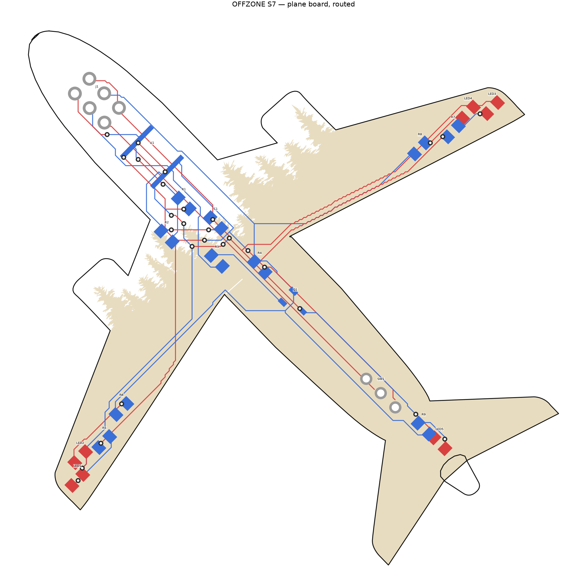

# Плата-самолёт: разводка

`plane_easyeda_routed.json` — плата 65 × 65,5 мм в формате EasyEDA Standard,
собранная из расстановки в `plane_easyeda.json` и разведённая полностью.
Открывается через **File → Open → EasyEDA**.



## Что изменено относительно исходной расстановки

| Что | Было | Стало | Почему |
|---|---|---|---|
| Q1 | `KT-13-SMD`, три площадки в ряд с шагом 2,5 мм, цепи 1-GND 2-LEDDRV 3-BASE | `SOT-23`, цепи **1-LEDDRV (К), 2-BASE (Б), 3-GND (Э)** | КТ3153А9 выпускается в КТ-46А (SOT-23), и его цоколёвка — 1 коллектор, 2 база, 3 эмиттер |
| LED1, LED3 | питались от `LEDDRV` | питаются от `VCC` через R5 и R7 | по схеме со скриншота два огня горят постоянно |
| LED2 | — | сдвинут на 0,41 мм от LED1 | площадки LED1.2(GND) и LED2.1(A2) стояли в 0,068 мм |
| LED4 | — | сдвинут на 0,56 мм от LED3 | площадки LED3.1(A3) и LED4.2(GND) стояли в 0,004 мм |

Два последних пункта — исправление замыкания: в исходной расстановке пары на
законцовках стояли в 2,42 мм друг от друга, и встречные площадки корпусов 0805
соприкасались. LED2 и LED3 оказались бы закорочены на землю и не зажглись бы.
Теперь зазор 0,315 и 0,316 мм.

## Огни

| Позиция | Место | Режим |
|---|---|---|
| LED1 | законцовка левого крыла | постоянно (БАНО) |
| LED2 | законцовка левого крыла | мигает |
| LED3 | законцовка правого крыла | постоянно (БАНО) |
| LED4 | законцовка правого крыла | мигает |
| LED5 | хвост | мигает |

Разбивка «по одному постоянному на крыло, остальные мигают» повторяет
аэронавигационные огни настоящего самолёта: ровные БАНО на крыльях плюс
проблесковые маяки. Цвета светодиодов не заданы — по-самолётному это красный
на левом крыле и зелёный на правом.

## Параметры разводки

| Параметр | Значение |
|---|---|
| Слои | 2 (TopLayer — светодиоды, BottomLayer — обвязка) |
| Ширина дорожки | 0,254 мм (10 mil) |
| Зазор | 0,254 мм (10 mil) |
| Переходное отверстие | 0,61 мм, сверло 0,3 мм |
| Отступ меди от контура | 0,5 мм |
| Дорожек / переходов | 50 / 28 |
| Суммарная длина дорожек | 532 мм |

Нормы с большим запасом относительно JLCPCB (минимум 0,127 мм / 5 mil).

## Проверки

`build_board.py` пересобирает плату из исходной расстановки и сам себя проверяет:

- каждая цепь — один связный остров меди (выводные площадки J1 и SW1 считаются
  соединяющими слои, как и переходные отверстия);
- нет нарушений зазора между дорожками и чужой медью;
- нет площадок разных цепей ближе 0,3 мм;
- ни одна дорожка, переход или площадка не выходит за контур платы и не попадает
  в отверстие под шнурок (проверено по 5926 точкам).

```
python build_board.py plane_easyeda.json plane_easyeda_routed.json
python render_pcb.py  plane_easyeda_routed.json plane_routed.png
```

## Чего в плате нет

- **Держателя батарейки.** По расчёту в `layout.py` при ширине 65 мм наибольшая
  вписанная окружность — 16,5 мм, а держателю CR2032 нужно 20 мм. Питание идёт
  через J1 (`VBAT`) и выключатель SW1.
- **Полигона земли.** Земля разведена дорожками; при желании можно залить
  полигон, но на таких токах это не обязательно.
- **Проверки зеркальности посадочных мест.** Компоненты стоят на нижнем слое, а
  генератор кладёт площадки без зеркалирования. Для двухвыводных резисторов и
  конденсаторов это неважно, но у U1 (SOIC-8), J1, SW1 и Q1 порядок выводов при
  монтаже снизу зеркалится. Это надо проверить до заказа — я эту логику не
  трогал, чтобы не расходиться с вашим генератором.
